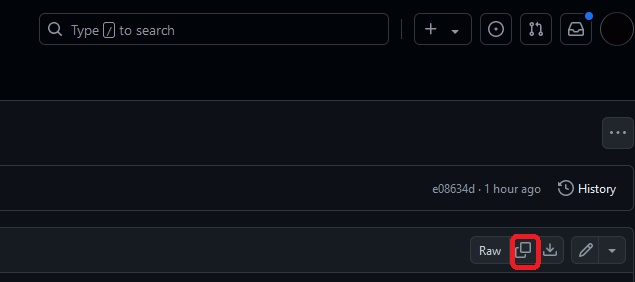
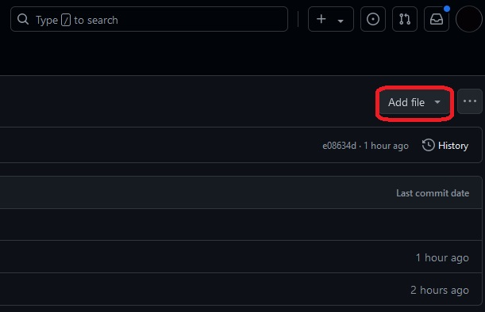

# Add publication/news post
## No-code in-browser approach

1. Navigate to the folder "_publications"/"_news"

2. Click on any publication file (.md) in that folder and copy it (top-right corner)

3. Navigate back to the folder "_publicaitons" and add a new file (top-right corner)

4. Paste the copied publication into the contents of the newly created file and name it. File name: naming convention is optional (YYYY-MM-DD-paper-name) but it should be a .md file. 

5. Adjust all the fields accordingly.
Important: the field date must be in the YYYY-MM-DD format.
The field author should contain all authors of this paper (listed on people.md).
The last three fields (author_profile, collection and classes) should not be changed.   

6. Commit the changes (top-right corner)

## Clone the 